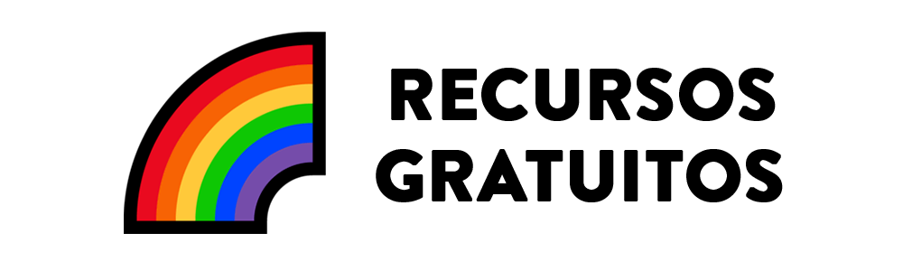
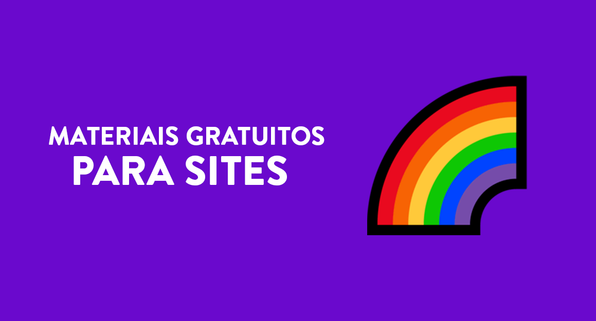
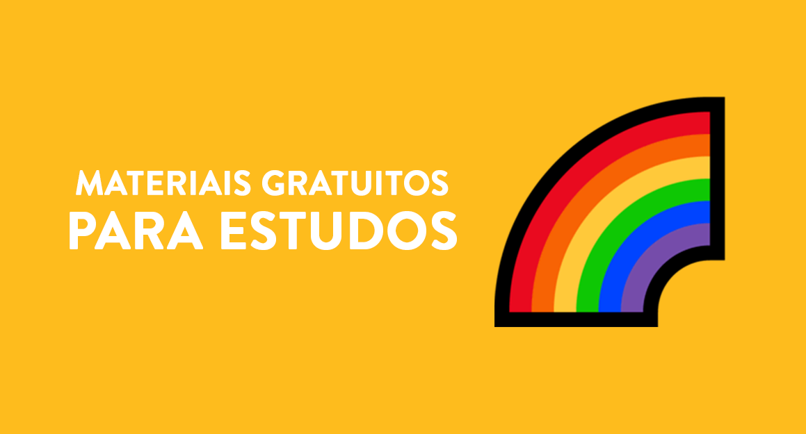
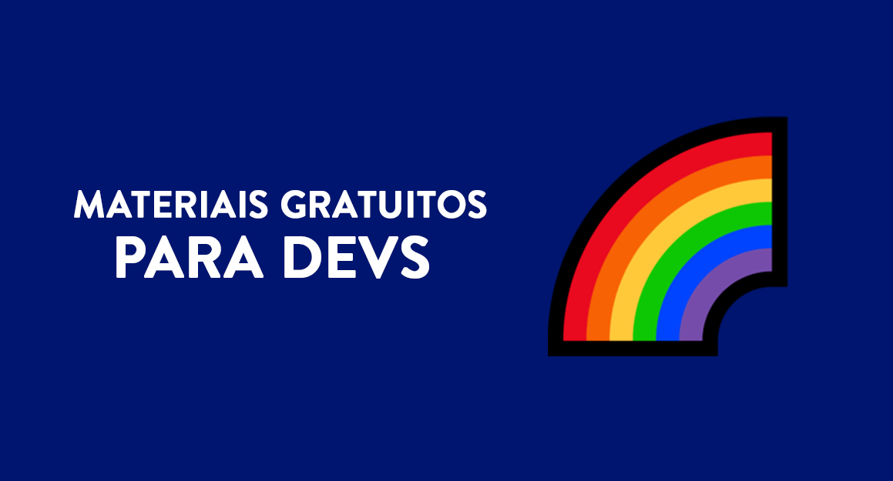
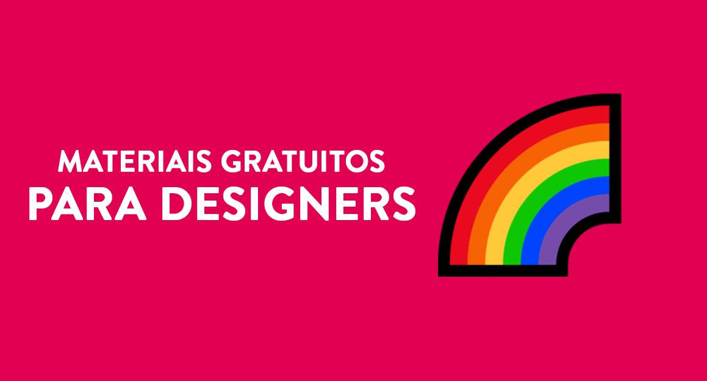

<h1 align="center">
  
</h1>

> Uma coisa que eu sempre fico em dúvida na hora de desenvolver ou aprender a fazer meus sites é sempre a mesma: <i>Quais recursos usar no projeto e onde encontrá-los?</i>
> Então, com essa dúvida criei esse repositório como resposta, mais do que apenas um monte de links, esta é uma seleção do que julgamos ser algumas das melhores oportunidades de aprendizado que você encontrará online gratuitamente.

## 📕 Índice 

📌 [Imagens](materiais-gratuitos-para-sites.md#-imagens) 
📌 [Ilustrações e Vetores](materiais-gratuitos-para-sites.md#-ilustrações-e-vetores) 
📌 [Emojis](materiais-gratuitos-para-sites.md#-emojis) 
📌 [Paletas de Cores](materiais-gratuitos-para-sites.md#-paletas-de-cores) 
📌 [Fontes e Fontes de ícones](materiais-gratuitos-para-sites.md#-fontes-e-fontes-de-ícones) 
📌 [Ícones](materiais-gratuitos-para-sites.md#-ícones) 
📌 [Animações e Gifs](materiais-gratuitos-para-sites.md#-animações-e-gifs) 
📌 [Logos](materiais-gratuitos-para-sites.md#-logos) 

---

## 📕 Índice 

📌 [Livros](materiais-gratuitos-para-estudos.md#-livros) 
📌 [Cursos](materiais-gratuitos-para-estudos.md#-cursos) 
📌 [Podcasts](materiais-gratuitos-para-estudos.md#-podcasts) 
📌 [Sites e Blogs](materiais-gratuitos-para-estudos.md#-sites-e-blogs) 

---

## 📕 Índice 

📌 [Ferramentas de desenvolvimento](materiais-gratuitos-para-devs.md#-ferramentas-de-desenvolvimento) 
📌 [IDEs e editores de código](materiais-gratuitos-para-devs.md#-ides-e-editores-de-código) 
📌 [Linguagens de programação](materiais-gratuitos-para-devs.md#-linguagens-de-programação) 
📌 [Hospedagem](materiais-gratuitos-para-devs.md#-hospedagem) 

---

## 📕 Índice 

📌 [Ferramentas](materiais-gratuitos-para-designers.md#-ferramentas)  

## ⚖ Licença
Esse projeto está sob licença. Veja o arquivo [LICENÇA](LICENSE.md) para mais detalhes. 

## ℹ️ Informações do projeto

